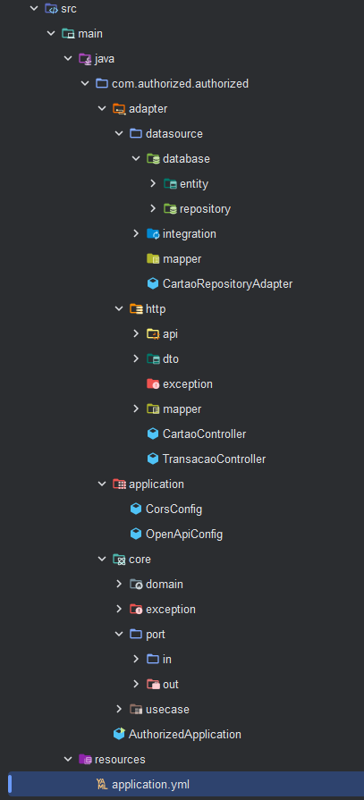
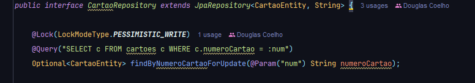
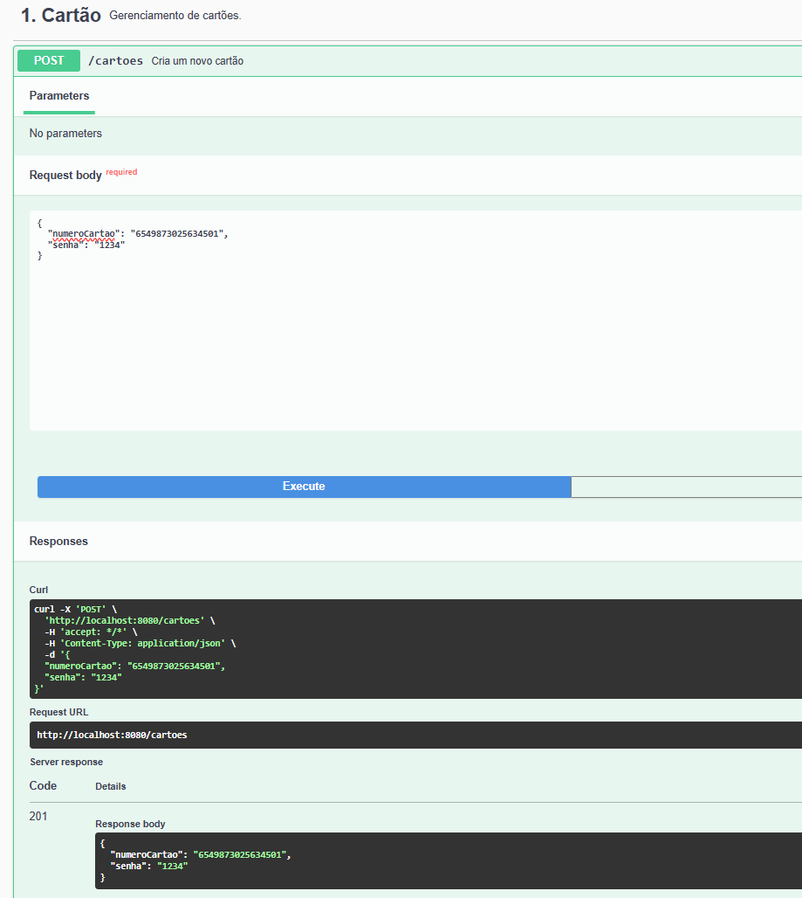
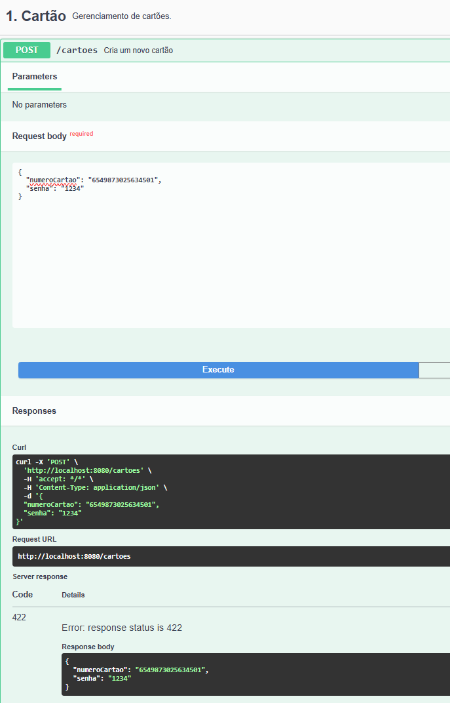
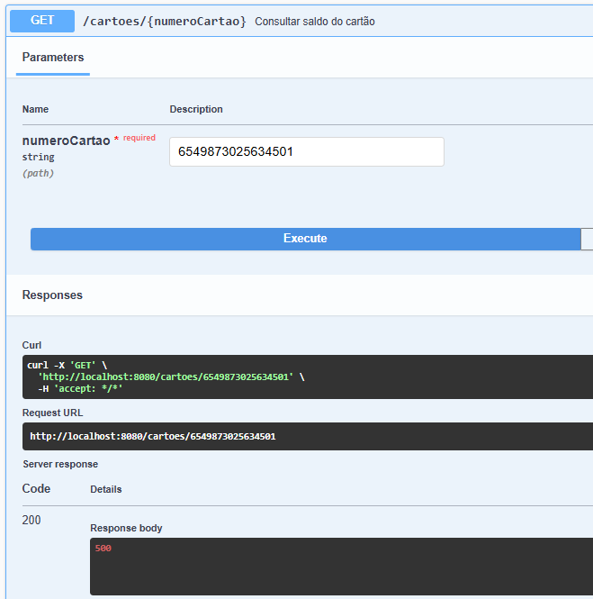
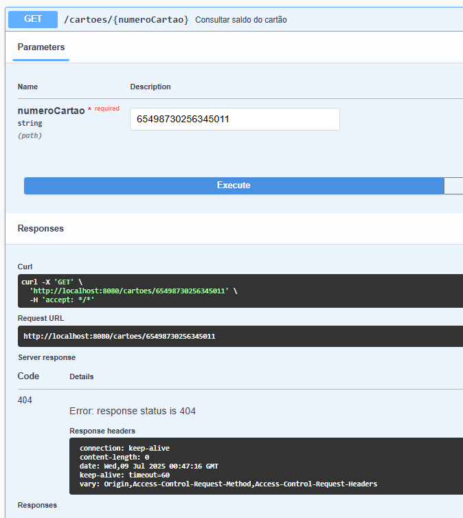
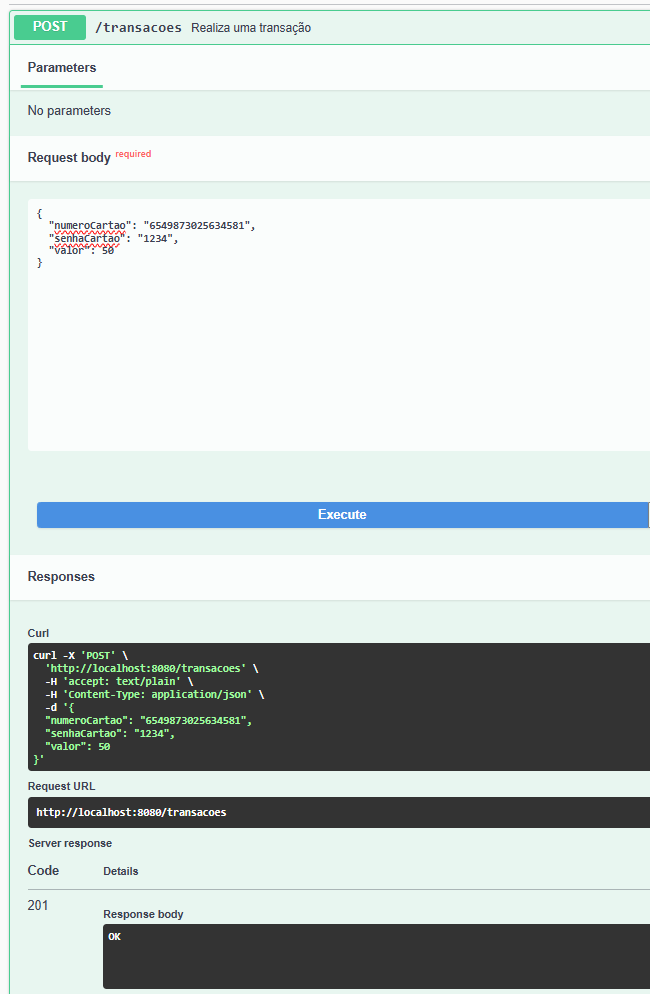
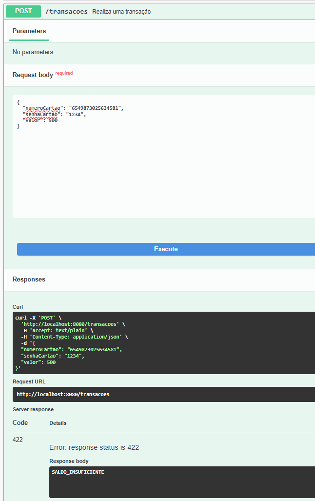

## Project Authorized

Este projeto implementa um Authorized de transações usando Spring Boot, arquitetura hexagonal, JPA e bloqueio pessimista para controle de concorrência.

### Arquitetura Hexagonal


Bloqueio Pessimista (SELECT ... FOR UPDATE)

Para garantir que duas transações simultâneas não leiam e alterem o saldo de um mesmo cartão ao mesmo tempo (evitando débito duplo), usamos pessimistic locking no JPA:

@Lock(LockModeType.PESSIMISTIC_WRITE): gera um SELECT ... FOR UPDATE, bloqueando o registro no banco até o fim da transação.

### Fluxo de duas transações simultâneas

1 - Primeira chamada:

 * Executa findByNumeroCartaoForUpdate(), obtendo e bloqueando a linha do cartão.

 * Valida senha e saldo, debita o valor e persiste.

 * Dá COMMIT, liberando o bloqueio e atualizando o saldo no banco.

2 - Segunda chamada (disparada simultaneamente):

 * Fica bloqueada no findByNumeroCartaoForUpdate() até a primeira transação comitar.

 * Após o COMMIT da primeira, a linha é lida com o saldo já atualizado (por ex. 0.00).

 * A lógica via Optional.filter falha no filtro de saldo e retorna SALDO_INSUFICIENTE.

## Contratos dos serviços

### Criar novo cartão
```
Method: POST
URL: http://localhost:8080/cartoes
Body (json):
{
    "numeroCartao": "6549873025634501",
    "senha": "1234"
}
```
#### Possíveis respostas:
```
Criação com sucesso:
   Status Code: 201
   Body (json):
   {
      "senha": "1234",
      "numeroCartao": "6549873025634501"
   } 
   
-----------------------------------------
Caso o cartão já exista:
   Status Code: 422
   Body (json):
   {
      "senha": "1234",
      "numeroCartao": "6549873025634501"
   } 
```



### Obter saldo do Cartão
```
Method: GET
URL: http://localhost:8080/cartoes/{numeroCartao} , onde {numeroCartao} é o número do cartão que se deseja consultar
```

#### Possíveis respostas:
```
Obtenção com sucesso:
   Status Code: 200
   Body: 495.15 
-----------------------------------------
Caso o cartão não exista:
   Status Code: 404 
   Sem Body
```



### Realizar uma Transação
```
Method: POST
URL: http://localhost:8080/transacoes
Body (json):
{
    "numeroCartao": "6549873025634501",
    "senhaCartao": "1234",
    "valor": 10.00
}
```

#### Possíveis respostas:
```
Transação realizada com sucesso:
   Status Code: 201
   Body: OK 
-----------------------------------------
Caso alguma regra de autorização tenha barrado a mesma:
   Status Code: 422 
   Body: SALDO_INSUFICIENTE|SENHA_INVALIDA|CARTAO_INEXISTENTE (dependendo da regra que impediu a autorização)
```




